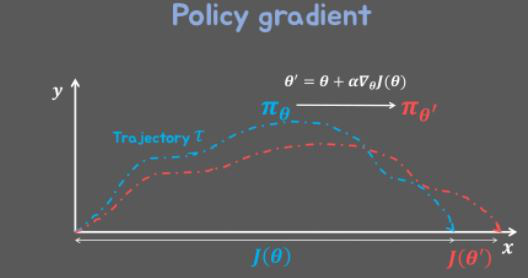

# 강화학습

## A3C : Asynchronous Advantage Actor-Critic(Mnih et al., 2016)
---

* 참고1 : RLCode와 A3C 쉽고 깊게 이해하기(https://www.youtube.com/watch?v=gINks-YCTBs&t=357s)
* 참고2 : [쉽게읽는 강화학습 논문 4화] A3C 논문 리뷰(https://www.youtube.com/watch?v=lfaaGQcQ2FE)
* 논문명 : Asynchronous Methods for Deep Reinforcement Learning(https://arxiv.org/abs/1602.01783)

* A3C : Asynchronous Advantage Actor-Critic

* 전체를 보여주는 이미지
  * <image src="image/A3C.png" style="width:500px">

* 개요
    * 1.샘플 사이의 상관관계를 비동기 업데이트로 해결
    * 2.Replay memory를 사용하지 않음
    * 3.policy gradient 알고리즘 사용가능(Actor-Critic)
    * 4.상대적으로 빠른 학습 속도(여러 에이전트가 환경과 상호작용)
    * 즉, AC = 비동기 + `Actor-Critic`
      * `Actor-Critic`이라는 Agent와 환경을 여러개 만들어서 비동기적으로 업데이트 해나가는 것이 A3C이다.

* **Contribution**
  * 1.다양한 RL 알고리즘의 **"scale-up"** 방법을 제시!
    * Off/on policy, Value/Policy based ... 모두에서 stable.
    * Experience Replay 대신 병렬적 actor가 decorrelation 가능케 해준다. => RL을 Supervised Learning처럼 학습하기 위해 Experience Replay, Target Network 등을 사용하고 iid 가정이 존재한다. 하지만 위와 같은 iid 가정이 필요없는 방법을 사용함으로써 좀 더 자유로워짐.
    * GPU 대신 CPU Thread를 사용.
    * 심지어 Super Linear... => Actor-learner thread가 1개 있을때보다 16개 있을 때 학습속도가 16배가 되어야 하는데 이것이 Linear하다는 뜻. Super Linear는 학습속도가 1개 썼을때 보다 16배보다 더 빨라진다는 뜻!
  * 2.SOTA 갱신! (State-Of-The-Art)

* 논문에서 다루는 4가지 알고리즘
  * One-step Q-learning(Value-based & off-policy)
  * N-step Q-learning(Value-based & off-policy)
  * One-step SARSA(Q-learning의 on-policy 버전)
  * Advantage-Actor Critic(on-policy)

* One-step Q-learning(Value-based & off-policy)
  * ex) T=5 일 때마다 Update the target network $(\theta^- \leftarrow \theta)$
  * Epsilon은 각 actor마다 다르게 설정할 수 있다.   
  * <image src="image/Q-learning.png" style="width:400px">

* One-step SARSA(Q-learning의 on-policy 버전 -> 내 policy의 action이 target을 정하는데 쓰임.)
  * 위의 Q-learning과 모두 동일하고, Q의 target value { $r+\gamma max_{a'}Q(s',a';\theta^-)$ }만 { $r+\gamma Q(s',a';\theta')$ } 이렇게 바꾸면 SARSA Version이 된다.
  * 즉, TD-target만 바뀌면 된다.

* `Actor-Critic`은 무엇일까?
    * Actor-Critic = REINFORCE + 실시간 학습 ::: REINFORCE라는 알고리즘을 online으로 학습하는 것.
    * REINFORCE : Policy gradient를 몬테카를로 방법으로 업데이트하는 것
    * `Critic`
      * Neural Network를 의미하며, 업데이트의 방향과 크기를 나타낸다.
      * 큐함수(Q-function)를 나타냄. $Q(S_t,A_t)*(-\sum y_ilogp_i )$ 계산해서 Gradient descent를 함. 여기서 $Q(S_t,A_t)$가 크리틱이다.

* 여러 개의 Agent
  * 여러개의 Agent들을 만들고(보통 16개) 각각 상태와 Action이 있을 때의 $Q(S_{t_1},A_{t_1})*(-\sum y_ilogp_i )$ 를 계산한다. 그리고 Gradient를 계산한다.
  * 이후, Global network를 업데이트 한다.
  * agent n이 비동기적으로 Global network를 업데이트한다.

* Policy gradient
  * 1.정책을 업데이트 하는 기준 : `목표함수`
  * 2.목표함수에 따라 정책을 업데이트하는 방법 : `Gradient ascent`
    * 1) 가치 기반 강화학습(Value-based)
      * 매 스텝마다 에이전트가 행동을 선택하는 기준 -> 가치함수(Value function)
    * 2) 정책 기반 강화학습(Policy-based)
      * 정책을 업데이트할 때마다 어떤 방향으로 업데이트할 지에 대한 기준
        * -> 목표함수(Objective function) or $J(\theta)$   
  * Policy gradient equivalent forms   
    <image src="image/A3C4.png" style="width:500px"> 
    <image src="image/A3C5.png" style="width:500px"> 
    <image src="image/A3C3.png" style="width:500px"> 

* 목표함수
  * 에이전트가 정책 $\pi_\theta$ 에 따라서 가게 되는 "경로,궤적(trajectory)"을 생각해보자!
  * "경로,궤적(trajectory)" = 에이전트와 환경이 상호작용한 흔적
    * "경로,궤적(trajectory)"는 에피소드(Episode)나 Rollout이라고 부르기도 한다.
    * initial state부터 terminal state까지 에이전트가 거친 (상태, 행동, 보상)의 sequence를 의미한다. 
    * $$\tau = (s_0, a_0, s_1, a_1, ... , s_T).$$
    * $J(\theta)$ = trajectory동안 받을 것이라고 기대하는 Reward의 합(trajectory가 매번 달라지므로 기대값을 사용함)
    * $J(\theta)=E[\sum_{t=0}^{T-1}r_{t+1}|\pi_\theta]=E[r_1+r_2+r_3 + ... +r_T|\pi_\theta]$
    * $J(\theta)$는 높은게 좋은 것이니까 Gradient Descent가 아닌 Gradient Ascent를 한다.(부호 +)

* Gradient Ascent
  * $J(\theta)$를 기준으로 어떻게 $\theta$(정책신경망)을 업데이트할 것인가?
  * ->$\theta$에 대한 $J(\theta)$의 경사를 따라 올라가다(Gradient Ascent)
  * $\theta'$ = $\theta'+\alpha\nabla_\theta J(\theta)$
  * $\nabla_\theta J(\theta)$ = Policy Gradient
  * 즉, 목적함수 $J(\theta)$를 미분한 것을 Policy Gradient라고 한다.

  * 

* REINFORCE
  * Discounted future reward를 Retun G($G_t$)라고 한다.
  * REINFORCE 알고리즘 업데이트 식
    * $\theta \leftarrow \theta + \alpha\nabla_\theta J(\theta) = \theta +\alpha\sum_{t=0}^{T-1}\nabla_\theta log\pi_\theta(a_t|s_t)G_t$
  * 절차
    * 1.한 에피소드를 현재 정책에 따라 실행
    * 2.Trajectory를 기록
    * 3.에피소드가 끝난 뒤 $G_t$ 계산
    * 4.Policy gradient를 계산해서 정책 업데이트
    * 5.(1~4) 반복 : 에피소드마다 업데이트하고 반복하므로 몬테카를로 Policy gradient라 부르며 이를 REINFORCE 알고리즘이라고 한다.
  * `REINFORCE 알고리즘의 문제점`
    * Variance가 높다.  ::: 에피소드가 길어질수록 다양한 Trajectory가 된다.
    * 에피소드마다 업데이트가 가능하다(on-line이 아니다.) -> 에이전트와 환경이 상호작용하는 동안에 업데이트를 할 수 없으므로 online이 아닌 offline으로 학습이 된다.

* REINFORCE 알고리즘을 보완한 Actor-Critic
  * 몬테카를로 -> `TD(Temporal-Difference)` 
    * 몬테카를로는 끝날때까지 진행하고 업데이트 하지만, TD는 한번만 진행해보고 업데이트하는 것이다.
  * REINFORCE -> `Actor-Critic`
    * 위의 몬테카를로에서 TD로 바꾸는 방법과 비슷한 뉘앙스이다.
    * 즉, REINFORCE 알고리즘은 에피소드가 끝나야 업데이트가 가능했지만, Actor-Critic은 매 스텝이 끝날 때마다 업데이트가 가능하도록 고안한 것이다.

* `Actor-Critic`
  * $\theta \leftarrow \theta + \alpha\nabla_\theta J(\theta) = \theta +\alpha\sum_{t=0}^{T-1}\nabla_\theta log\pi_\theta(a_t|s_t)G_t$ 의 $G_t$를 $Q_{\pi\theta}(s_t,a_t)$로 바꿀 수 있다.
  * 만약 $Q_{\pi\theta}(s_t,a_t)$를 알 수 있다면 매 time-step마다 업데이트하는 것이 가능해진다!!!
  * $Q_{\pi\theta}(s_t,a_t) \sim Q_w(s_t,a_t)$ ::: 즉, 두 개의 네트워크(Q-function과 Policy)를 사용한다는 뜻. 이 부분(Q)이 **Critic**이 된다.
  * 내가 지금 하는 행동에 대해서 Q가 좋은지 안좋은지를 판단해 주는 것이 **Critic**이다.

* `Actor-Critic` - Advantage 함수
  * `Advantage 함수` = 큐함수 - 베이스라인 -> Variance를 낮춰준다.
  * Q-function : 특정 상태, 특정 행동에 따른 값
  * Value-function : 특정 상태, 전반적 행동에 따른 값 -> 베이스라인

* 간단 요약
  * `Actor`
    * 1) 정책(Policy)을 근사 : $\theta$, 실제로 행동하는 Actor network
    * 2) $\nabla_\theta log\pi_\theta (a_t|s_t)(r_{t+1} + \gamma V_v(s_{t+1})-V_v(s_t))$로 업데이트
  * `Critic`
    * 가치함수(Value function)을 근사 : $v$, $Q(s,a)$[가치를 평가하는 critic network]
    * $(r_{t+1} + \gamma V_v(s_{t+1})-V_v(s_t))^2$의 loss function으로 업데이트

* `A3C`
  * Actor-Critic과 다른점
    * Actor를 업데이트하는 과정에서 아래 2가지 부분이 다르다.
    * 1.Multi-step loss function
      * 1-step => multi-step(bias가 줄일 수 있으며 효율적인 시간활용을 할 수 있다.)
      * ex) 20 step : 20 step마다 20개의 loss function을 더한 것으로 업데이트
    * 2.Entropy loss function
      * 20개의 cross entropy : exploitation
* A3C pseudocode(수도 코드)  
  <image src="image/A3C6.png" style="width:600px;">

## DDPG :  Deep Deterministic Policy Gradient(Lillicrap et al, 2015)
---

* 참고 1 : PR-019: Continuous Control with Deep Reinforcement Learning(https://www.youtube.com/watch?v=h2WSVBAC1t4)
* 참고 2 : https://reinforcement-learning-kr.github.io/2018/06/26/3_ddpg/
* 논문 : Continuous Control with Deep Reinforcement Learning(https://arxiv.org/abs/1509.02971)

* 개요
  * `DDPG(Deep Deterministic Policy Gradient)`는 DPG에 DQN을 결합시킨 **model-free off-policy actor-critic algorithm**이다. DQN(Deep Q-Network)는 experience replay와 frozen target network를 통해서 Q-network에 대한 학습을 안정화시켰다. 원래 DQN은 discrete space상에서 동작하지만, DDPG는 actor-critic framework를 활용하여 deterministic policy를 학습하면서 효과를 continuous space까지로 확장시켰다.

* DQN
  * high-dimensional observation spaces
  * discrete and low-dimensional action spaces
  * Limitation of DQN
    * high-dimensional observation spaces에서는 잘 작동했지만 high-dimensional Continuous Action Spaces의 경우에는 잘 작동하지 않았다.
    * 따라서, high-dimensional Continuous Action Spacesdml의 경우에 Deep RL을 어떻게 구현할 수 있을까? 하는 의문에서 나온 것이 **DDPG**다. 

* Q-learning(No), Policy Gradient(Yes)
  * Q-learning자체가 discrete한 action space에 맞는 방법이다. 따라서 Q-learning말고 Continuous한 Action space를 처리할 수 있는 (Deterministic) Policy Gradient 기법을 사용하도록 한다.
  * 그런데, neural network(nonlinear function approximator)로 actor-critic을 구현하는 것은 어려웠다.(unstable and challenging)
  * 따라서, DQN에서의 insight를 가져와서 해결하도록 했다.
    * Experience Replay
    * Target Network의 사용 : Modified using "soft" target updates(일정 iteration이 다 돌고 update하는 것이 아닌 조금씩 soft하게 update하는 것을 의미함)
    * Batch Normalization

* Policy
  * $\pi, \mu$ = policy
  * `Deterministic` policy : $a=\mu(s)$ ::: -> 즉, 어떤 state에서 항상 어떤 action을 하게 된다. 
  * Stochastic policy : $\pi(a|s)$ ::: -> 어떤 state에서 action을 할 확률이 주어진다.

* Background   
  * <image src="image/DDPG.png" style="width:600px;">
  * 설명 : 첫 번째 수식은 SARSA 알고리즘이다. $Q^\pi(s_t,a_t)$를 업데이트하기 위해서 $(s_0,a_0,r,s_1,a_1)$이 필요하다. 하지만 아래 수식에서는 target policy를 deterministic하게 만들어서 SARSA의 마지막 $a_1$(action)을 몰라도 되도록 만들었다. 즉, $(s_0,a_0,r,s_1)$만으로 $Q^\mu(s_t,a_t)$를 계산할 수 있다. 
  * Deterministic policy를 가정하기 전의 수식에서는 $a_{t+1}$을 골랐던 순간의 policy로 Q에 대한 Expection을 원래 구해야하기 때문에 off-policy가 아니지만, Determinsitic policy를 가정한다면 update 할 당시의 policy로 $a_{t+1}$를 구할 수 있기 때문에 off-policy가 된다.   
  * <image src="image/DDPG2.png" style="width:600px;">
  * 그렇다면 DQN을 continuous action spaces에 바로 적용이 가능할까? NO!!
  * $\mu(s) = \argmax_aQ(s,a)$  => DQN에서는 diterministic policy($\mu(s)$)가 argmax로 주어진다. 그래서 action space는 high-dimension에서 max값을 찾는 `optimization problem`이 된다. 그런데 이는 (too slow to be practical) 하다. 따라서 DQN을 바로 continuous action space에 적용할 수 없다.
  * 위의 방법이 안되니까, `Actor-Critic Approach based on Deterministic Policy Gradient`를 써보자라는 식이다.

* Actor-Critic
  * <image src="image/DDPG3.png" style="width:600px;">

* DDPG
  * <image src="image/DDPG4.png" style="width:500px;">
  * $(s_1,a_t,r_t,s_{t+1})$이 있으면 Q-function을 업데이트할 수 있으니, 이를 replay buffer $R$에다가 넣어둔다.
  * $R$에서 $N$개의 mini-batch size만큼을 뽑아서 target 값 $y_i$를 계산한다.
  * 그리고 loss function을 적용해 critic과 actor policy를 업데이트한다.
  * DDPG 알고리즘 특징
    * Replay buffer 사용 : DDPG는 DQN에서 사용된 Replay buffer를 사용하여 online batch update를 가능하게 한다.
    * “soft” target update 사용 : DQN에서는 일정 주기마다 origin network의 weight를 target network로 직접 복사해서 사용했는데, DDPG에서는 exponential moving average(지수이동평균)식으로 대체한다. stochatic gradient descent와 같이 급격하게 학습이 진행되는 것을 막기 위해 사용하는 것 같다.
    * 각 차원의 scale이 다른 low dimension vector로부터 학습할 때 Batch Normalization을 사용 => 서로 scale이 다른 feature를 state로 사용할 때에 Neural Net이 일반화에서 어려움을 겪는데, 해결하기 위해 스케일을 조정했다.
    * 탐험을 위해 action에 Noise를 추가 => ORNSTEIN UHLENBECK PROCESS(OU)을 사용했는데 OU Process는 평균으로 회귀하는 random process이다. ( $dxt=θ(μ−x_t)dt+σdW_t$)
      *  θ 는 얼마나 빨리 평균으로 회귀할 지를 나타내는 파라미터이며 μ는 평균을 의미함
      *  σ는 process의 변동성을 의미하며 Wt는 Wiener process를 의미함

* DDPG 다이어그램
  * <image src="image/DDPG5.png" style="width:600px;">

## TRPO : Trust Region Policy Optimization(ICML 2015, citation 2564)
---

* 참고1 : https://reinforcement-learning-kr.github.io/2018/06/24/5_trpo/
* 참고2 : [쉽게읽는 강화학습 논문 5화] TRPO 논문 리뷰(https://reinforcement-learning-kr.github.io/2018/06/24/5_trpo/)
* 논문명 : Asynchronous Methods for Deep Reinforcement Learning(https://arxiv.org/abs/1502.05477)

* 개요 및 contribution
  * DQN보다 성능이 엄청좋다 이런 것이 아니라, 이론적으로 안전하게 policy를 최적화할 수 있는 수식을 유도하고 그 수식에 여러 근사치를 넣어서 practical하게 쓸 수 있게 알고리즘을 만들었다. 또한 이 알고리즘은 잘 작동했다. (새로운 방법론 및 알고리즘 제시)

* Index
  * 준비 운동(Preliminaries)
  * 모든 것의 출발점 : Kakade & Langford
  * General한 improvement guarantee
  * 보다 practical한 알고리즘
  * 샘플 기반의 objective and constraint estimation

* 1.준비 운동(Preliminaries)
  * MDP : $S, A, P, r, \rho_0, \gamma$ 
    * $S$ : state의 집합
    * $A$ : Action의 집합
    * $P$ : $S \times A\times S \rightarrow \mathbb{R}$. 즉, state에서 action을 했을 때 어떠한 state로 갈 확률
    * $r$ : Reward function
    * $\gamma$ : discount factor(0 ~ 1 사이의 값)
    * $\rho_0$ : 시작할 때 어느 state에서 시작하는지의 분포
  * Policy
    * $\pi$ : state에서 action을 할 확률(0 ~ 1 사이의 값)  
  * <image src="image/TRPO.PNG" style="width:400px;">
  * $\eta(\pi)$ : Policy가 받을 return의 기댓값임. 즉, Policy의 성능을 나타내는 수식 
  * $Q_\pi(s_t,a_t)$ : t state에서 action을 할 때, 그때부터 추가로 받을 dicount reward의 합의 기대값이다.
  * $V_\pi(s_t)$ : t state에서 끝날 때까지 받는 reward 합의 기대값이다.

* 2.모든 것의 출발점 : Kakade & Langford
  * <image src="image/TRPO2.PNG" style="width:400px">
  * $\eta(\tilde{\pi})$는 $\eta(\pi)$ + 어드벤티지의 기대값이다. ★☆★☆
  * 위의 말을 쉽게 설명하면, $\pi$의 어드벤지티를 $\tilde{\pi}$의 경로(trajectory)에다가 가중치합을 했을 때 $\tilde{\pi}$의 성능이 나오게 된다라는 의미이다. 아래 그림은 예시이다.   
  * <image src="image/TRPO3.PNG" style="width:400px">
  * 위 그림에서 $\eta(\tilde{\pi})$를 구할 때, $\tilde{\pi}$의 확률을 쓰고, Advantage 값은 $\pi$ 값을 쓴다. 즉, 다른 Policy의 성능을 알고 싶을 때, 아는 Policy로부터 구할 수 있다. 
  * 증명 :  <image src="image/TRPO4.PNG" style="width:400px">
  * Discounted visitation frequency는 state에 있을 확률을 $\gamma$를 취해서 모두 더한 값이다. 그렇게 되면 에피소드동안 state(s)에 있을 확률이 구해지게 된다. (unnormalized) -> 이 확률은 1이 넘을 수 있다. 
  * <image src="image/TRPO5.PNG" style="width:400px">
  * <image src="image/TRPO6.PNG" style="width:400px">
  * <image src="image/TRPO7.PNG" style="width:400px">
  * <image src="image/TRPO8.PNG" style="width:400px">

* 3.General한 improvement guarantee
  * Total variation divergence 개념을 도입(두 확률분포 사이의 얼마나 다른지의 개념)
  * $D_{TV}(p\;||\;q)={1\over2}\sum_i|p_i-q_i|$   
  * <image src="image/TRPO9.PNG" style="width:400px">
  * p와 q는 확률분포를 의미하고, $D_{TV}$는 p와 q가 얼마나 다른지를 나타내주는 값임. 두 확률분포가 같으면 $D_{TV}$는 0이다.   
  * <image src="image/TRPO10.PNG" style="width:400px">
  * <image src="image/TRPO11.PNG" style="width:400px">
  * <image src="image/TRPO12.PNG" style="width:400px">
  * Algorithm 1 : Policy iteration algorithm quarantteeing non-decreasing expected return $\eta$
  * Policy의 성능을 의미하는 $\eta$가 줄어들지 않는 것을 보장해 준다. 매번 업데이트할 때 유지하거나 늘어나거나 improvement를 guaranteeing(보장)한다.
  * <image src="image/TRPO13.PNG" style="width:400px">

* 4.보다 practical(실용적)한 알고리즘
  * <image src="image/TRPO14.PNG" style="width:400px">
  * <image src="image/TRPO15.PNG" style="width:400px;"> 
  * $C$는 이론적으로 유도된 숫자이기 때문에 너무 커서 실제로 사용할 수가 없다. 즉 penalty가 너무 커서 step size가 매우 작아질 수 밖에 없다. 따라서 이 penalty형태를 constraint 형태($subject \; to\; D^{max}_{KL}(\theta_{old},\theta) \leq \delta$ )로 변경해준다.(최적화)   
  * <image src="image/TRPO16.PNG" style="width:400px;">
  * $D^{max}_{KL}(\theta_{old},\theta)$를 구할 수 없어서 $\bar{D}^{\rho}_{KL}(\theta_1,\theta_2)$를 사용한다. 각 state별 KL Divergence의 평균을 나타낸다.

* 5.샘플 기반의 objective and constraint estimation
  * <image src="image/TRPO17.PNG" style="width:400px;">
  * <image src="image/TRPO19.PNG" style="width:400px;">
  * <image src="image/TRPO18.PNG" style="width:400px;">
  * 위의 과정을 통해 Expectation 형태로 만들어준 것이다.
  * 에피소드(Trajectory)를 만들어서 샘플값을 구한다음 위의 수식들을 도출하면 된다.
  * 샘플들을 뽑는 방법은 2가지를 제시했다. **Sing Path**와 **Vine**!!
  * <image src="image/TRPO20.PNG" style="width:400px;">
  * <image src="image/TRPO21.PNG" style="width:400px;">  
    * 1.**Sing Path**와 **Vine**의 procedure를 이용해서 state-action pair set을 모은다. 그리고 Q-value의 몬테카를로 estimate도 모은다.
    * 2.그리고 그 샘플들의 평균을 계산하고, objective와 constraint의 estimate 값을 구한다.
    * 3.constraint optimization 문제를 푼다.(생략)

* 요약
  * <image src="image/TRPO22.PNG" style="width:400px;">

## PPO : Proximal Policy Optimization(2017, OpenAI)
---

* 참고 1 : [쉽게읽는 강화학습 논문 6화] PPO 논문 리뷰(https://www.youtube.com/watch?v=L-QYXtJmXrc)
* 참고 2 : [MC러닝의 강화학습 연구소] OpenAI Spinning UP 번역] Proximal Policy Optimization (https://mclearninglab.tistory.com/145) 
* 논문명 : Proximal Policy Optimization Algorithms(https://arxiv.org/abs/1707.06347)

* Idea
  * TRPO와 같은 질문으로부터 출발 : `지금 얻은 데이터로 가능한 큰 STEP만큼 update하고 싶은데.. 그렇다고 너무 멀리 가서 성능을 떨어뜨리고 싶지도 않은데.. 어떻게 하면 좋을까?`
  * TRPO는 이 문제를 복잡한 second-order method(이차미분)로 풀려고 했다.
    * 얼만큼 업데이트해야 안전한가, penalty term과 constraint term 등이 있었다.
    * PPO는 first-order 방법론이며 on-policy알고리즘이다.
    * 트릭을 사용하여 새로운 policy를 기존의 policy와 가깝도록 유지하게 해준다.
    * 굉장히 구현이 간단하며, 실증적으로도 좋은 성능을 보여준다.
  * TRPO는 2차 근사까지 보는데 PPO 논문에서는 1차 근사까지만 본다.

* Background
  * PPO는 현재 가지고 있는 데이터로 성능을 떨어뜨리지 않으면서 정책을 개선시키는 step을 가능한 멀리 밟도록하려면 어떻게 해야하는 지에 대해 고민했다는 점에서 TRPO와 같습니다. TRPO는 복잡한 2차 근사(second-order) 방법으로 해결했다면, PPO는 이전 정책과 새로운 정책이 가깝게 유지하도록 약간 트릭을 사용한 선형 근사(first-order) 방법으로 구현이 더 간단하면서도, 최소한 TRPO만큼의 성능을 보이는 것 같습니다.
  * PPO는 PPO-penalty와 PPO-Clip 두 가지 방식이 있습니다.
  * PPO-Penalty는 TRPO처럼 KL-constrained 업데이트로 근사해서 풀지만, 제한하는 것 대신 목적 함수에서 KL-divergence에 패널티를 주는 방식을 택했고 이를 위한 패널티 계수를 학습하면서 자동으로 크기를 조정합니다.
  * PPO-Clip은 KL-divergence가 목적함수에도, constraint에도 전혀 없습니다. 대신 목적 함수에 특별한 clipping으로 새로운 정책이 이전 정책에서 멀어지지 않도록 합니다.

* Quick Facts
  * PPO는 on-policy 알고리즘입니다.
  * PPO는 discrete하거나 continuous한 action space를 가진 환경에서 사용할 수 있습니다.
  * Spinning UP 구현에서는 MPI를 이용한 병렬화(parallelization)를 지원합니다.

* 주요 방정식(Key Equations)
  * PPO-clip은 다음을 통해 정책을 업데이트 합니다.
    * <image src="image/PPO11.PNG" style="width:250px;">
  * 보통 미니배치를 사용해 SGD으로 여러 학습하여 목적함수를 최대화하도록 합니다. 여기서 $L$ 다음과 같습니다.
    * <image src="image/PPO12.PNG" style="width:400px;">
  * ϵ은 이전 정책보다 새로운 정책이 얼마나 더 많이 변해도 될지 정해주는 (작은 값의) 하이퍼파라미터(hyperparameter) 정도로 볼 수 있습니다.
  * 꽤 복잡해 보이고 처음 보기엔 뭐가 어떻게 돌아가는지, 새로운 정책이 이전 정책과 어떻게 가깝게 유지하도록 해주는 건지 잘 모를 수 있습니다. 찾아보면 이보다 더 다루기 쉽게 상당히 단순화된 형태가 있습니다. (OpenAI code에서도 이와 같이 구현되어 있습니다.)
    * <image src="image/PPO13.PNG" style="width:400px;">
    * 이 때 $g$는 다음과 같습니다.
    * <image src="image/PPO14.PNG" style="width:250px;">
  * 이에 담겨있는 직관을 얻기 위해 어떤 한 상태-행동 쌍$(s,a)$이 있다고 생각해봅시다. (그래서 어떤 Advantage 값이 나왔다고 해봅시다.)
  * **Advantage가 양수인 경우** : Advantage가 양수인 경우 다음과 같이 목적함수를 줄일 수 있습니다.
    * <image src="image/PPO15.PNG" style="width:350px;">
    * advantage가 양수이기 때문에, 행동을 더 자주한다면, 즉 $π_θ(a|s)$가 증가한다면 목적함수도 증가할겁니다. 하지만 min 항이 이러한 목적함수의 증가를 제한하고 있습니다. $πθ(a|s) > (1+ϵ)π_{θ_k}(a|s)$라면, min은 $(1+ϵ)A^{π_{θ_k}}(s,a)$라는 값을 갖도록 할겁니다. 결국, 새로운 정책은 이전 정책보다 멀리 가도 더 특별한 이득이 없게 됩니다.
  * **Advantage가 음수인 경우** : Advantage가 음수인 경우 다음과 같이 목적함수를 줄일 수 있습니다.
    * <image src="image/PPO16.PNG" style="width:350px;">
    * advantage가 음수이기 때문에, 행동을 덜 하게 된다면, 즉 $π_θ(a|s)$가 감소한다면 목적함수는 증가할겁니다. 하지만 max 항이 이러한 목적함수의 증가를 제한하고 있습니다. $πθ(a|s) <> (1+ϵ)π_{θ_k}(a|s)$ 라면, max은 $(1-ϵ)A^{π_{θ_k}}(s,a)$라는 값을 갖도록 할겁니다. 결국, 새로운 정책은 이전 정책보다 멀리 가도 더 특별한 이득이 없게 됩니다.

* Clipping
  * 이러한 clipping은 장기적으로 의미있는 정책 업데이트를 할 수 있도록 해주지만, 새로운 정책이 이전 정책보다 과하게 멀리 떨어질 가능성은 여전히 있습니다. 그래서 이를 피하기 위한 다른 PPO 구현 트릭들이 많이 사용되고 있습니다. 여기 구현에서는 특히 간단한 방법을 사용하는데, 바로 early stopping입니다. 이전 정책과 새로운 정책의 KL-divergence가 일정 기준치(threshold)를 넘어가게 되면, 학습을 멈추는 방법이죠.

* 의사 코드(Pseudo code)
* <image src="image/PPO17.PNG" style="width:450px;">

* Background 이어서..
  * <image src="image/PPO1.PNG" style="width:400px;">
  * <image src="image/PPO2.PNG" style="width:400px;">
  * <image src="image/PPO3.PNG" style="width:400px;">
  * <image src="image/PPO4.PNG" style="width:400px;">

* PPO의 첫 번째 방법 ::: PPO Clipped <- 실험적으로는 첫번 째 방법이 더 좋음
  * <image src="image/PPO5.PNG" style="width:400px;">
  * $epsilon(\epsilon)$
  * $r_t(\theta)$를 $(1-\epsilon ,1+\epsilon)$ 사이로 Clip한다.
  * Clipped Loss와 Original Loss 중에 둘 중에 작은 것을 사용하자. 그러면 그게 원래 Loss의 Lower bound가 된다.
  * 위 그림 왼쪽 그래프에서 보면 **빨간점**이 의미하는 것은 업데이트가 시작되는 지점이다. ($\theta_{old}$와 $\theta$가 같은 지점이다. 즉 r이 1인 지점)
  * $L^{clip}$ 함수가 r에 대해서 어떻게 변화하나 확인하는데, A>0 인 지점에서는 r을 1보다 크게 하려고 업데이트를 할 것이다. 그런데 $1+\epsilon$ 이상 키울 수 없도록 만들어 주는 것이다.
  * A<0 인 지점에서는 r을 1보다 줄이려고 할 것이다. r이 action을 할 확률인데, 이전보다 좀 덜하게 해야하니까 r을 1보다 줄이려고 한다. 그리고 줄이는 하한선은 $1-\epsilon$ 까지로 정하는 것이다.
  * 즉, r이 너무 급변하지 않도록 하는 것.
  * penalty와 constraint가 없으며, 위의 loss만 받아서 업데이트하면 된다.
  * $\epsilon$은 하이퍼파라메터여서 0.2나 0.1 등등 해보면 된다.
  * <image src="image/PPO6.PNG" style="width:400px;">
    * N개의 Actor들이 environment안에서 T timestep만큼 policy를 실행한다. 예를 들어 100개의 Actor가 있고 각 Actor들이 50 step만큼 action을해서 데이터를 쌓으면 100x50만큼 데이터가 쌓인다. 5000개의 각 timestep마다 Advantage를 계산한다. 그리고 SGD나 Adam 등을 사용해서 $L^{clip}$ function을 optimize하면 된다. 이러한 과정을 여러번 하면 된다.

* PPO의 두 번째 방법 ::: Adaptive KL Penalty
  * <image src="image/PPO7.PNG" style="width:400px;">
  * $L^{KLPEN}(\Theta)$ :: KL divergence penalty
  * $\beta$를 adaptive하게 계속 바꿔준다. KL divergence 값 $d$이 $d_{target}$보다 많이 작아지면 KL divergence가 많이 안벌어진 것을 의미하므로 $\beta$를 줄여주는 것. 
  * 즉, KL divergnece가 너무 높았으면 $\beta$를 키우고, KL divergnece가 너무 작았으면 $\beta$를 줄이는 것이다.
  * KL divergnece가 너무 높았다는 것은 policy가 너무 많이 변했다는 것이므로 KL penalty를 많이 주어야 한다.

* PPO 실험
  * <image src="image/PPO8.PNG" style="width:400px;">
  * <image src="image/PPO9.PNG" style="width:400px;">
  * <image src="image/PPO10.PNG" style="width:400px;">
