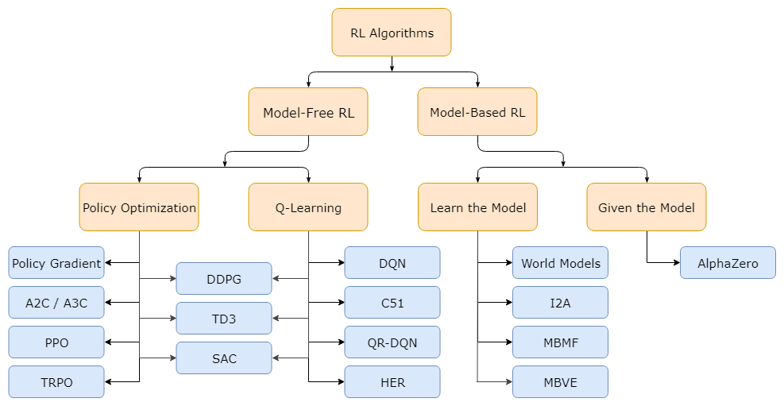

# 1. MC러닝의 강화학습 연구소 : Online Tutorials/OpenAI Spinning Up
# OpenAI Spinning Up 번역] Part 1: 강화학습 핵심 개념(Key Concepts in RL)
#### 출처 : https://mclearninglab.tistory.com/53?category=843332

OpenAI Spinning UP에서 강화학습을 소개하는 부분이 있었다. 오 이거 정리해두면 좋겠는데?(불행의 시작)라는 마음으로 해석에 도전했다. 강화학습 쪽 영어는 그래도 알아들을 거라 생각해서 였는데 생각보다 고통스러운 발번역의 나날...그래도 나름 최선을 다했어 난!

원본은 Part 1: Key Concepts in RL

OpenAI Spinning Up 번역] Part 1: 강화학습 핵심 개념(Key Concepts in RL)
OpenAI Spinning Up 번역] Part 2: 강화학습 알고리즘 종류(Kinds of RL Algorithms)
OpenAI Spinning Up 번역] Part 3: 정책 최적화 소개(Intro to Policy Optimization)

## Table of Contents
---

* Part 1: 강화학습 핵심 개념
    * 강화학습은 무엇을 할 수 있나요?
    * 핵심 개념과 용어
    * (옵션) 공식

강화학습 소개에 오신것을 환영합니다! 여기서 배울 목표는 다음과 같습니다.

주제에 대해서 사용할 용어와 표기법
강화학습 알고리즘이 간략하게 무엇을 하는지 (어떻게 동작하는 지에 대한 것들은 대부분 생략합니다.)
그리고 이 알고리즘들을 기반으로 하고 있는 핵심적인 수학 조금
간단히 말하자면, 강화학습은 에이전트(agent)와 시행착오(trial and error)를 통해 어떻게 학습하는지에 대한 연구를 말합니다. 에이전트의 행동에 대해 보상과 처벌을 주어서 미래에 어떤 행동을 계속하게 하거나 그만두도록 만드는 것을 식으로 표현합니다.

### What Can RL Do?
---

강화학습은 최근에 다양한 분야에서 활약하고 있습니다. 예를 들면, 시뮬레이션에서 로봇을 제어하도록 컴퓨터를 학습을 할 수 있습니다.

Your browser does not support the video element.

...그리고 현실 세계에선...

또한 아주 엄청난 AI를 만드는 데에도 사용되어서 유명하죠. 바둑, 도타, 픽셀값만으로 Atari 게임을 하도록 컴퓨터를 학습시키고 인간의 지시에 따라 학습된 시뮬레이트 로봇 등이 있습니다.

### Key Concepts and Terminology
---
Agent-environment interaction loop

강화학습의 중요한 특징이라 할 수 있는 에이전트(Agent)와 환경(environment)입니다. 환경은 에이전트가 살아가면서 상호작용(interact)해가는 세계(World)라 입니다. 상호작용하는 스텝(step)마다 에이전트는 세계의 상태를 (아마 일부) observation을 보고 취할 행동(action)을 결정합니다. 환경은 에이전트가 행동할 때 변하지만 스스로 변할 때도 있습니다.

에이전트는 환경으로부터 현재 세계 상태가 좋은지 나쁜지를 얘기해주는 숫자 reward를 받습니다. 에이전트의 목표는 앞으로 받을 보상들의 합인 return을 최대화하도록 하는 것입니다. 그래서 강화학습은 에이전트가 이 목표를 위해 취해야 할 행동을 배울 수 있게하는 것이라 할 수 있습니다.

강화학습에 대해 좀 더 구체적으로 말하기 전에 추가적인 용어를 소개할 필요가 있겠네요. 다음과 같은 것들을 얘기해야할 것 같습니다.

* states and observations
* action spaces
* policies
* trajectories
* different formulations of return
* the RL optimization problem
* value function

### states and observations
---

상태(state) $s$는 세계의 상태에 대해 완전히 알려줍니다. 상태로부터 숨겨진 세계의 정보는 없습니다. 하지만 observation $o$는 정보가 생략되어 있을 수 있는 상태의 부분적인 표현입니다.

심층 강화학습(Deep RL)에서는 이러한 상태와 observation을 거의 대부분 실수 벡터, 행렬, 또는 그 이상의 고차원 텐서로 표현합니다. 예를 들어, 시각적으로 본다면 픽셀 값의 RGB 행렬로 표현할 수 있고 로봇의 상태를 표현한다면 관절의 각도나 속도로 나타낼 수 있겠죠.

에이전트가 환경의 완전한 상태를 관찰할 수 있다면, 이를 fully observed라고 하고 에이전트가 부분적으로 관찰할 수 있다면, 이를 partially observed 라고 합니다.

#### 알아두세요
```
강화학습 표기법은 observation 기호 o 대신 기술적으로 좀 더 적절하다면 상태 s를 쓰기도 합니다. 특히 에이전트가 행동을 어떻게 하냐에 대해 얘기할 때 일어나는 일인데요. 행동은 상태에 따른 표기를 하지만 실제로 행동은 observation에 따라 달라집니다. 왜냐하면 에이전트는 상태를 알지 못하기 때문입니다.

이 가이드에서는 표준 표기 규칙을 따르지만, 문맥들이 의미하는 바를 이해하는 게 좋습니다. 만약 애매하다면, issue를 올려주세요! 우리 목표는 가르치는 것이지 혼란을 주는 것은 아니니까요.
```

### Action Spaces
---

다른 환경은 다른 종류의 행동이 나옵니다. 주어진 환경에서의 모든 유효한 행동(valid action) 집합은 보통 행동 공간(action space) 라고 불립니다. Atari나 바둑같은 환경은 에이전트가 가능한 행동의 수가 제한된 분리된 행동 공간(discrete action space) 을 가집니다. 다른 환경, 예를 들어 물리적인 세계에서 로봇을 제어하는 에이전트 같은 경우는 연속 행동 공간 (continuous action) 을 가질 것입니다. 연속 공간에서는 행동은 실수 벡터를 가집니다.

이러한 구별을 통해 심층 강화학습의 방법들은 꽤 인상적인 결과들을 가져옵니다. 어떤 방법들은 오직 한 경우에만 적용할 수 있으며, 다른 경우에 적용하려면 보통 다시 작업해야 합니다.

### Policies
---

정책 (policy) 은 에이전트가 취할 행동을 결정하는 규칙입니다. 결정적(deterministic)이라면 보통 $\mu$를 통해 정의됩니다.

$$ a_t = \mu(s_t). $$

또는 확률적(stochastic)이라면 $\pi$에 의해 정의됩니다.

$$ a_t \sim \pi(\cdot | s_t) $$

왜냐하면 정책은 기본적으로 에이전트의 두뇌이기 때문에, "정책"을 "agent" 대신 사용하기도 합니다. 예를 들어, "정책은 보상을 최대화 하려 한다." 같은 게 있습니다.

심층 강화학습에서는 파라미터를 가진 정책(parameterized policy) 를 사용합니다. 출력이 파라미터(예를 들어 신경망의 가중치나 바이어스)에 의존하는 계산 가능한 함수로, 어떤 최적화 알고리즘을 통해 행동을 변화시키도록 조정할 수 있습니다.

정책의 파라미터를 $\theta$나 $\phi$ 로 정의하고 연결되어 있음을 강조하기 위해 정책 기호(symbol)를 첨자로 씁니다.

$$ a_t = \mu_{\theta}(s_t) $$ $$ a_t \sim \pi_{\theta}(\cdot | s_t). $$

### Deterministic Policies
---

예: Deterministic Policies. 텐서플로우에서 연속적인 행동 공간(continuous action space)을 위한 간단한 deterministic policy를 구현한 코드 일부가 있습니다.

```
obs = tf.placeholder(shape=(None, obs_dim), dtype=tf.float32)
net = mlp(obs, hidden_dims=(64, 64), activation=tf.tanh)
actions = tf.layers.dense(net, units=act_dim, activation=None)
```

여기서 mlp는 각각 크기와 활성화 함수가 정해진 dense layer를 여러 개 쌓은 함수입니다.

### Stochastic Policies
---

심층 강화학습에서 stochastic polices는 대표적으로 두 종류가 있습니다. categorical policies와 diagonal Gaussian policies.

Categorical 정책은 분리된(discrete) 행동 공간에서 사용되는 반면, Gaussian은 연속적인 행동 공간에서 사용됩니다.

stochastic policy를 사용하고 학습할 때 두 가지의 계산이 아주 중요합니다.

* 정책에서 행동을 샘플링(sampling)하기
* 그리고 특정 동작의 log likelihoods $\log \pi_{\theta}(a|s)$를 계산하기

이어서, categorical 정책과 diaonal Gaussian 정책이 어떻게 동작하는지 설명할 것입니다.

### Categorical Policies
---

categorical policy는 discrete action에 대한 분류자(classifier)같은 겁니다. classifier를 구현할 때 처럼 categorical 정책을 위한 신경망을 구현하는겁니다. 입력이 observation이고 뒤 이어 몇 개의 layer가 나올 것이고(아마 convolutional이나 densely-connected겠죠. 입력이 어떤 종류냐에 달려있을 겁니다) 각 행동에 대한 logits을 출력하는 마지막 레이어가 있고 뒤이어 logit을 확률로 변환하는 softmax가 나올겁니다.

샘플링 행동에 대한 각 확률이 주어졌다고 할 때, 텐서플로우 같은 프레임워크는 샘플링을 위한 도구가 내장되어 있습니다. 예를 들어 tf.distributions.Categorical 문서나 tf.multinomial를 보시면 될겁니다.

Log-Likelihood 확률을 가진 마지막 layer를 $P_\theta(s)$라고 정의하겠습니다. 행동의 수만큼 가지고 있는 벡터이기 때문에 행동을 인덱스로 사용할 수 있습니다. 행동 $a$에 대한 log likelihood는 벡터에 인덱싱 하여 얻을 수 있습니다.

$$ \log \pi_{\theta}(a|s) = \log \left[P_{\theta}(s)\right]_a $$

### Diagonal Gaussian Policies
---

multivariate Gaussian distribution (또는 multivariate normal distribution)는 평균 벡터 $\mu$와 covariance matrix $\Sigma$에 의해 결정됩니다. diagonal Gaussian distribution은 covariance matrix가 대각선에만 요소를 가지는 특수한 경우를 말합니다. 결과적으로 이는 벡터로 나타낼 수 있죠.

diagonal Gaussian 정책은 항상 신경망을 가지고 observation을 행동 평균 $\mu_{\theta}(s)$로 맵핑합니다. covariance matrix을 나타낼 수 있는 방법이 일반적으로 두 가지가 있습니다.

* `첫 번째 방법`: 상태의 함수가 아닌 log 표준편차 $\log \sigma$의 벡터입니다. 이는 독립적으로 존재하는 파라미터입니다. (알아두세요. 이것이 나중에 VPG, TRPO, 그리고 PPO 구현 때 이렇게 사용합니다.)

* `두 번째 방법` : 상태로부터 log 표준편차 $\log \sigma_{\theta}(s)$로 맵핑하는 신경망입니다. 평균 네트워크로 몇 개의 층은 선택적으로 공유할수도 있습니다.

두 가지 경우 다 표준 편차를 직접 출력하는 것 대신에 log 표준 편차를 출력합니다. 왜냐하면 log 표준편차는 $(-\infty, \infty)$의 범위로 어떤 값이든 자유로운 반면, 표준 편차는 음수가 아니어야 한다는 제한이 있기 때문입니다. 제한을 두지 않는 것이 파라미터를 학습하기에 더 쉽습니다. 표준 편차는 log 표준 편차를 지수를 곱해서 바로 얻어낼 수 있기에 이를 나타내는 데 어떠한 손실도 없습니다.

* `샘플링(Sampling)`. 평균 벡터 $\mu_{\theta}(s)$와 표준 편차 $\sigma_{\theta}(s)$ 그리고 spherical Gaussian($z \sim \mathcal{N}(0, I)$)의 노이즈 벡터 $z$가 있다고 할 때, 행동 샘플은 다음과 같이 계산할 수 있습니다.

$$ a = \mu_{\theta}(s) + \sigma_{\theta}(s) \odot z $$

여기서 $\odot$는 두 벡터를 요소별로(elementwise) 곱한 것을 정의한것입니다. 표준 프레임워크는 tf.random_normal같이 노이즈 벡터를 계산해주는 내장 기능이 있습니다. 또는, 평균과 표준 편차를 tf.distributions.Normal 객체로 평균과 표준편차를 주어서 샘플링하는 데에 사용할 수도 있습니다.

* `Log-Likelihood`. 평균이 $\mu = \mu_{\theta}(s)$이고 표준 편차가 $\sigma = \sigma_{\theta}(s)$라고 할 때, k개 차원의 행동 $a$의 log-likelihood는 다음과 같이 나타낸다.

$$\log \pi_{\theta}(a|s) = -\frac{1}{2}\left(\sum_{i=1}^k \left(\frac{(a_i - \mu_i)^2}{\sigma_i^2} + 2 \log \sigma_i \right) + k \log 2\pi \right)$$

### Trajectories
---

trajectory $\tau$는 상태와 행동의 시퀀스입니다.

$$\tau = (s_0, a_0, s_1, a_1, ...).$$

맨 첫 번째 상태 $s_0$는 start-state distribution, 가끔 $\rho_0$로 정의되는 이것에 의해 임의로 샘플링됩니다.

$$s_0 \sim \rho_0(\cdot)$$

상태 전이(state transitions) ($t$ 시간 때의 상태 $s_t$와 $t+1$ 때의 상태 $s_{t+1}$ 간에 일어나는 일)는 환경의 자연적인 법칙에 따라 최근 행동 $a_t$에만 의존합니다. deterministic이라면 다음과 같이 될 것이고,

$$ s_{t+1} = f(s_t, a_t) $$

stochastic이라면,

$$s_{t+1} \sim P(\cdot|s_t, a_t)$$

정책에 따라 에이전트가 행동을 결정합니다.

#### 알아두세요
```
Tarjectory는 종종 episode나 rollout이라 합니다.
```

### Reward and Return
---

보상(reward) $R$은 강화학습에서 아주 중요합니다. 세계의 현재 상태, 행동 그리고 다음 상태에 따라 달라집니다.

$$ r_t = R(s_t, a_t, s_{t+1}) $$

보통 현재 상태 ($r_t=R(s_t)$)나 상태, 행동 쌍 ($r_t=R(s_t, a_t)$)으로 간단히 표현할 수 있습니다.

에이전트의 목표는 trajectory에 따라 보상 합이 최대가 되도록 하는 것이지만 위에서 본 것처럼 몇 가지로 더 표현할 수 있습니다. 그래서 모든 경우에 대해 $R(\tau)$로 표기하겠습니다. 문맥적으로 좀 더 명확하기도 하고 딱히 중요한 것은 아니니까요. (왜냐하면 모든 경우에 동일한 방정식이 적용되니까요)

return의 종류 중 하나는 finite-horizon undiscounted return입니다. 일정하게 고정된 스텝에서 얻을 수 있는 보상들의 합을 말합니다.

$$ R(\tau) = \sum_{t=0}^T r_t $$

또다른 하나는 infinite-horizon discounted return입니다. 이것 또한 에이전트가 받을 수 있는 모든 보상의 합이지만, 얼마나 먼 미래에서 받았냐에 따라 감소합니다. 그래서 보상의 식에서 discount factor $\gamma \in (0,1)$가 들어있습니다.

$$ R(\tau) = \sum_{t=0}^{\infty} \gamma^t r_t $$

근데, 왜 discount factor가 필요할까요? 그냥 보상 모두를 받으면 안되는걸까요? 그렇게 할수도 있지만, 직관적으로 그럴만하고 수학적으로 편하기 때문입니다. 직관적인 수준에서 얘기하자면 현재 받을 돈이 나중에 받을 돈보다 좋다는 얘기를 들 수 있고, 수학적으로 보자면 무한하게 보상의 합을 얻게된다고 하면 유한한 값으로 수렴이 안할 수도 있고, 수식으로 표현하기도 쉽지 않습니다. 하지만 discount factor와 어떤 적절한 조건이 만족한다면 무한한 합이 수렴할 수 있게 됩니다.

#### 알아두세요
```
위에 return에 관한 두 식은 RL 형식에서는 꽤나 뚜렷한 차이가 있지만, deep RL에서는 약간 애매모호한 일이 있을 수 있습니다. 예를 들어, 보통 undiscounted return을 최적화하는 알고리즘들을 쓰지만 value function을 추정하는데 discount factor를 사용합니다.
```

### The RL Problem
----

어떤 return을(infinite-horizon discounted 또는 finite-horizon undiscounted) 사용하든, 어떤 정책을 사용하든, 강화학습에 있어 목표는 에이전트가 expected return에 대하여 행동하며 이를 최대화하는 정책을 선택해야한다는 것입니다.

expected return에 대해 얘기하려면, 먼저 trajectory에 대한 확률 분포에 대해 얘기해야합니다.

환경 전이(transition)와 정책이 모두 확률적(stochastic)이라고 가정하겠습니다. 이 경우 T 스텝이 지난 trajectory의 확률은

$$ P(\tau|\pi) = \rho_0 (s_0) \prod_{t=0}^{T-1} P(s_{t+1} | s_t, a_t) \pi(a_t | s_t). $$

expected return (어떤 것을 사용하든) $J(\pi)$로 정의되어 다음과 같습니다.

$$ J(\pi) = \int_{\tau} P(\tau|\pi) R(\tau) = E_{\tau\sim \pi}{R(\tau)}. $$

그렇다면 강화학습에 있어 중요한 최적화 문제는 다음과 같이 표현할 수 있습니다.

$$ \pi^* = \arg \max_{\pi} J(\pi) $$

여기서 $\pi^*$는 최적의 정책을 말합니다.

### Value Functions
----
가끔 상태나 상태-행동 쌍의 가치(value)를 알면 유용합니다. 이는 상태 또는 상태-행동 쌍에서 시작하여 어떤 특정 정책에 따라 쭈욱 계속 행동했을 때 얻을 수 있는 expected return을 의미합니다. 가치 함수(Value function)는 거의 모든 RL 알고리즘에서 사용됩니다.

여기 알아야할 4가지 함수가 있습니다.

1. On-Policy Value Function
상태 $s$에서 시작해서 정책 $\pi$에 따라 항상 행동할 때 얻을 수 있는 expected return입니다.

$$ V^{\pi}(s) = E_{\tau \sim \pi}{R(\tau)\left| s_0 = s\right.} $$

2. On-Policy Action-Value Function
어떤 상태 $s$에서 행동 $a$를 한 이후, 정책 $\pi$에 따라 항상 행동할 때 얻을 수 있는 expected return입니다.

$$ Q^{\pi}(s,a) = E_{\tau \sim \pi}{R(\tau)\left| s_0 = s, a_0 = a\right.} $$

3. Optimal Value Function
상태에서 $s$ 최적의 정책을 따를 때 얻을 수 있는 expected return입니다.

$$ V^*(s) = \max_{\pi} E_{\tau \sim \pi}{R(\tau)\left| s_0 = s\right.} $$

4. Optimal Action-Value Function
어떤 상태 $s$에서 행동 $a$를 한 이후, 최적의 정책을 따를 때 얻을 수 있는 expected return입니다.

$$ Q^*(s,a) = \max_{\pi} E_{\tau \sim \pi}{R(\tau)\left| s_0 = s, a_0 = a\right.} $$

#### 알아두세요
가치 함수에 대해 얘기할 때, 시간 의존에 대한 언급이 딱히 없다면, infinite-horizon discounted return을 의미할 것입니다. finite-horizon discounted return은 매개변수로 시간이 필요합니다. 왜 그럴까요? 힌트 : 시간이 다 되면 어떻게 되나요?

#### 알아두세요
종종 나타나는 가치 함수와 행동 가치 함수간의 중요한 연관성이 있습니다. $$V^{\pi}(s) = E_{a\sim \pi}{Q^{\pi}(s,a)}.$$

그리고

$$ V^\ast(s) = \max_a Q^\ast(s,a).$$

이렇게 주어진 정의에서 꽤 직접적으로 관계를 가지는데 증명할 수 있나요?


### The Optimal Q-Function and the Optimal Action
----
최적의 행동 가치 함수 $Q^\ast(s,a)$와 최적의 정책에 의해 선택된 행동 간의 중요한 연관성이 있습니다. 정의에 의해 $Q^\ast(s,a)$는 주어진 상태 $s$에서 한 행동 $a$으로 부터 최적의 정책을 쭈욱 따를 때의 expected return 값을 줍니다.

$s$에서 최적의 정책은 $s$에서 시작하여 expected return이 최대가 되는 행동이 되도록 선택하는 것입니다. 결과적으로 $Q^\ast$를 가지고 있다고 하면, 최적의 행동 $a^\ast(s)$을 직접적으로 얻을 수 있는 겁니다. 다음과 같은 식을 통해서 말이죠.

$$ a^\ast(s) = \arg \max_a Q^\ast(s,a). $$

참고: $Q^*(s,a)$를 최대화 하는 행동이 여러 개 있을 수 있습니다. 이 경우 그 행동들 모두 최적이고 최적의 정책은 그것들 중 하나를 선택하는 것일 수 있습니다. 하지만 결정적으로(deterministically) 행동을 선택하는 최적의 정책은 항상 있습니다.

### Bellman Equations
---
4가지 가치함수 모두 벨만 방정식(Bellman equation)이라는 특별한 self-consistency 방정식을 따릅니다. 벨만 방정식 속에 있는 아이디어는 다음과 같습니다.

* 시작 지점에서의 가치는 그 다음 도착할 곳에 대한 가치와 그곳에서 얻을 수 있는 보상의 합입니다.

on-policy 가치 함수를 위한 벨만방정식은

$$ V^{\pi}(s) = E_{a \sim \pi, \ s'\sim P}\left[r(s,a) + \gamma V^{\pi}(s')\right],$$ $$Q^{\pi}(s,a) = E_{s'\sim P}\left[r(s,a) + \gamma E_{a'\sim \pi}{Q^{\pi}(s',a')}\right],$$

여기서 $s' \sim P$는 $s' \sim P(\cdot |s,a)$의 축약형으로 다음 상태 $s'$가 환경 전이 규칙에 따라 샘플링된 것을 나타내고, $a \sim \pi$는 $a \sim \pi(\cdot|s)$의, $a' \sim \pi$는 $a' \sim \pi(\cdot|s')$의 축약형을 나타낸다.

최적의 가치 함수에 대한 벨만 방정식은

$$ V^\ast(s) = \max_a E_{s'\sim P}\left[r(s,a) + \gamma V^\ast(s')\right], $$

$$ Q^\ast(s,a) = E_{s'\sim P}\left[r(s,a) + \gamma \max_{a'} Q^\ast(s',a')\right]. $$

on-policy 가치 함수에 대한 벨만 방정식과 최적의 가치 함수에 대한 벨만 방정식의 결정적인 차이는 행동에 $\max$가 있냐 없냐입니다. 포함되면 에이전트가 행동을 선택을 할 때, 최적의 행동을 하기 위해 가장 높은 값이 나오도록 선택해야 한다는 점을 반영합니다.

#### 알아두세요

용어 "벨만 backup"은 강화학습 문헌에서 자주 등장합니다. 상태나 상태행동 쌍의 벨만 backup은 벨만 방정식의 오른쪽 항의 (보상 + 다음 가치)입니다.

### Advantage Functions
---

강화학습에서 가끔, 절대적으로 행동이 얼마나 좋은지 기술할 필요는 없지만, 평균에 비해 얼마나 좋은지는 기술할 필요가 있습니다. 즉, 말하자면 행동의 상대적인 advantage을 알고싶다는 얘기입니다. 이러한 advantage function의 개념을 정확히 다루어보겠습니다.

정책 $\pi$에 따른 advantage function $A^{\pi}(s,a)$는 상태 $s$에서 특정 행동 $a$를 취하는 것이 $\pi(\cdot|s)$에 따라 임의로 행동을 선택한 것보다 $\pi$를 무한히 행동할 때 얼마나 더 좋은지를 말합니다. 수학적으로, advantage function은 다음과 같이 정의됩니다.

$$ A^{\pi}(s,a) = Q^{\pi}(s,a) - V^{\pi}(s). $$

#### 알아두세요
이에 대해선 나중에 다룰 예정이지만 advantage function은 policy gradient 방법에서 매우 중요합니다.

### (Optional) Formalism
---

지금까지, 에이전트의 환경에 대해서 간단히(informal) 다루었지만 문헌을 통해 깊게 가고싶을 경우 표준 수학 공식을 따르고 싶을겁니다. Markov Decision Process (MDPs). MDP는 5개의 값을 가지고 있는 튜플 $\langle S, A, R, P, \rho_0 \rangle$ 입니다.

* $S$는 모든 유효한 상태의 집합입니다.
* $A$는 모든 유효한 행동의 집합입니다.
* $R : S \times A \times S \to \mathbb{R}$는 보상 함수로 다음과 같습니다. $r_t = R(s_t, a_t, s_{t+1})$
* $P : S \times A \to \mathcal{P}(S)$는 상태 전이 함수로 상태 $s$에서 행동 $a$를 취하면 상태 $s'$로 전이할 확률 $P(s'|s,a)$을 말합니다.
* 그리고 $\rho_0$는 초기 상태 분포입니다.

Markov Decision Process라는 이름은 Markov property를 따르는 시스템을 참조합니다. Markov property는 전이할 때 오로지 가장 최근 상태와 행동만을 의존하고 그 이전의 과거는 영향을 받지 않는 것을 말합니다.

### 으아 번역 끝!
---

다음 번역은 Part 2: Kinds of RL Algorithms을 할 예정이다.

---
---
---
<br>
<br>

# 2. MC러닝의 강화학습 연구소 : Online Tutorials/OpenAI Spinning Up
## OpenAI Spinning Up 번역] Part 2: 강화학습 알고리즘 종류
#### 출처 : https://mclearninglab.tistory.com/64

원본은 Part 2: Kinds of RL Algorithms

OpenAI Spinning Up 번역] Part 1: 강화학습 핵심 개념(Key Concepts in RL)
OpenAI Spinning Up 번역] Part 2: 강화학습 알고리즘 종류(Kinds of RL Algorithms)
OpenAI Spinning Up 번역] Part 3: 정책 최적화 소개(Intro to Policy Optimization)

### Table of Contents
---
* Part 2: Kinds of RL Algorithms
    * A Taxonomy of RL Algorithms
    * Links to Algorithms in Taxonomy

이제까지 강화학습 용어와 표기법에 대한 기본을 익혔으니, 이제 좀 더 다양한 것들을 다룰 것입니다. 현대 강화학습 알고리즘들과 알고리즘을 설계하면서 생기는 trade-off 같은 것들을 말이죠.

### A Taxonomy of RL Algorithms
---



철저하게 다 나열한 것은 아니지만 유용하게 분류된 현대 강화학습 알고리즘들입니다. 논문 인용은 맨 아래에 있습니다.

이번 절에서는 한 가지를 포기하고 시작하고자 합니다. 현대 강화학습 알고리즘들을 정확하게 포괄적으로 그려내는 것은 매우 어렵습니다. 트리 구조로 알고리즘 모듈성을 잘 표현하는 게 쉽지 않기 때문이죠. 또, 적절하게 소화할 수 있도록 한페이지에 다 담아내기 위해서 꽤 많은 고급 자료를 생략을 해야합니다. (exploration, transfer learning, meta learning 등) 즉, 우리의 목표는

* 무엇을, 어떻게 학습해야 하는지에 대한 심층 강화학습 알고리즘들의 가장 기초적인 설계 부분을 집중 조명하기 위해서,
* 이러한 설계 과정에서 생기는 trade-off를 경험하게 하기 위해서,
* 그리고 이러한 과정에서 몇몇 유명한 현대 알고리즘을 사용해볼 수 있게 하기 위해서

### Model-Free vs Model-Based RL
---
강화학습 알고리즘에서 가장 중요한 분기점 중 하나는 `에이전트가 환경의 모델(model)에 접근하거나 학습하는지`에 대한 의문입니다. 환경의 모델은 상태 전이와 보상을 예측하는 것을 말합니다.

모델을 가지면 좋은점이 미리 앞부분을 생각하고, 가능한 선택의 범위에서 무엇이 일어날지 보고, 거기서 나온 선택 사항 중에서 선택하도록 해서 **에이전트가 계획을 세울 수 있게 한다는 점입니다.** 에이전트는 학습된 정책을 향해 계획한 결과를 내게됩니다. 이러한 방법으로 특히 유명한 것이 바로 <span style="color:DeepSkyBlue">AlphaZero</span>입니다. 이 방법을 사용하게 되면 모델이 없는 방법보다 샘플 효율에 있어서 크게 향상된 결과를 가져옵니다.

단점은 **에이전트가 환경의 ground-truth 모델을 사용할 수 없다는 것입니다.** 만약 이러한 경우에서 에이전트가 모델을 사용하고 싶다면, 순전히 경험으로부터 배워야합니다. 하지만 이러한 경우 몇 가지 문제가 있죠. 그 중 가장 큰 문제는 에이전트에 의한 모델의 편향(bias)으로, 학습된 모델에 대하여 에이전트는 잘 수행하겠지만, 실제 환경에서는 차선으로 (또는 이상하게) 행동할 수 있습니다. 그래서 모델을 학습 하는 것은 근본적으로 어려워서 많은 노력(수많은 시간과 계산을 투자해서)해도 실패로 돌아갈 수 있습니다.

모델을 사용하는 알고리즘은 **model-based** 방법이라 불리고, 이를 사용하지 않는 방법은 **model-free**. model-free 방법은 모델을 사용하여 생기는 샘플 효율에서의 잠재적인 이득은 얻을 수 없지만, 구현이나 튜닝에 있어서 쉬운 편이다. 이 글을 작성하던 시기 (2018년 9월)에, model-free 방법은 model-based 방법보다 매우 유명하고 개발되고 테스트되고 있다.

### What to Learn
---

강화학습에서 또 다른 중요한 분기점은 무엇을 학습하는지에 대한 의문이다. 보통 다음을 포함하고 있다.

* 정책, 확률적(stochastic)인가 결정적(deterministic)인가
* 행동 가치함수 (Q-functions)
* 가치 함수
* 그리고, 또는 환경 모델

### What to Learn in Model-Free RL
---

model-free RL의 에이전트를 나타내고 학습하는 방법은 크게 두 가지가 있다.

**Policy Optimization**. 이런 종류의 방법들은 $\pi_{\theta}(a|s)$과 같이 명시적으로 정책을 나타냅니다. 직접적으로 성능 목표 $J(\pi_{\theta})$로 gradient ascent를 하고, 간접적으로 $J(\pi_{\theta})$의 local 근사값을 최대화해서 파라미터를 최적화하죠. 이 최적화는 거의 항상 on-policy로 수행됩니다. 이 말은, 가장 최근의 정책에 따라 행동하면서 모인 데이터를 사용해 각각 업데이트한다는 것을 의미합니다. 또 policy optimization는 on-policy 가치 함수 $V^{\pi}(s)$에 대한 approximator $V_{\phi}(s)$를 학습하는 것도 포함되어 있어서 정책을 어떻게 업데이트하는지 알아내는데 사용됩니다.

policy optimization의 몇 가지 예를 들자면

* <span style="color:DodgerBlue">A2C / A3C</span>, 직접적으로 성능을 최대화하기 위해 gradient ascent를 수행합니다.
* 그리고 <span style="color:DodgerBlue">PPO</span>는 $J(\pi_{\theta})$가 업데이트 결과로 얼마나 변할지를 conservative 추정을 한 surrogate objective function을 최대화하는 방법으로 간접적으로 성능을 최대화 합니다.

**Q-Learning**. 이런 종류의 방법들은 최적의 행동 가치 함수, $Q^\ast(s,a)$가 되도록 approximator $Q_{\theta}(s,a)$를 학습합니다. 보통 이것들은 <span style="color:DodgerBlue">Bellman equation</span>을 기반으로 한 objective function을 사용하죠. 이 최적화는 거의 항상 **off-policy**로 수행됩니다. 이 말은, 데이터를 얻을 때 환경을 탐험하기 위해 어떻게 선택했는지와 상관없이 학습하면서 어떤 지점에서의 모인 데이터를 사용합니다. 이에 상응하는 정책은 $Q^\ast$와 $\pi^\ast$간의 연결에 의해 얻어집니다. Q-learning 에이전트는 다음에 의해 행동이 정해집니다.

$$ a(s) = \arg \max_a Q_{\theta}(s,a). $$

Q-learning 방법의 예로는 다음과 같이 있는데요

* DQN, 심층 강화학습 분야에서 대부분 이것으로 시작하는 고전 알고리즘입니다.
* C51, return의 개대값이 $Q^\ast$인 분포를 학습하는 변형된 알고리즘입니다.

**Trade-offs Between Policy Optimization and Q-Learning.** policy optimization 방법들의 주된 강점은 원하는 방향으로 직접적으로 최적화한다는 의미에서 원칙적(principled)입니다. 그래서 안정적이고 신뢰성이 있습니다. 반면, Q-learning 방법들은 self-consistency 방정식을 만족하는 $Q_\theta$를 학습해서 agent의 성능을 간접적으로만 최적화합니다. 이러한 방법들에는 많은 실패가 있어서, 덜 안정적인 편이죠. 하지만 Q-learning 방법은 잘 동작한다면 대체로 더 많은 샘플 효율이 이루어진다는 장점이 있습니다. 왜냐하면 데이터를 policy optimization 기술보다 더 효과적으로 재활용하기 때문이죠.

**Interpolating Between Policy Optimization and Q-learning** 우연히도(Serendipitously), policy optimization과 Q-learning은 서로 양립할 수 없습니다. (그리고 어떤 조건에서는 같은(Equivalence) 경우도 있다고 합니다.) 그리고 이 두 개 사이에서 존재하는 알고리즘들도 있습니다. 이 스펙트럼 속에서 존재하는 알고리즘은 양측의 강약을 조심스럽게 조절(trade-off)할 수 있습니다. 예는 다음과 같습니다.

* DDPG, deterministic policy와 Q-function을 서로 발전시켜 동시에 학습시킵니다.
* SAC, 확률적인 정책(stochastic policy), entropy regularization, 그리고 그 외 안정적인 학습을 위한 트릭들을 사용해 표준 벤치마크에서 DDPG보다 더 높은 점수를 얻은 변형 형태입니다.

```
[1] Q-learning이 어떻게 그리고 왜 실패했는지에 대한 자세한 설명은 1) Tsitsiklis and van Roy의 고전 논문, 2) (좀 더 최근인) Szepesvari의 리뷰(section 4.3.2에 있음) 그리고 3) Sutton과 Barto의 chapter 11, 특히 11.3(function approximation, bootstrapping, 그리고 off-policy data의 "the deadly triad" 모두 value-learning 알고리즘에서 불안정하게 만드는 요인들임)에서 찾아보면 될 것 같습니다.
```

### What to Learn in Model-Based RL
---

model-free RL과는 다르게, model-based RL을 정의하기 쉬운 방법이 많지 않습니다. 모델을 사용하는 것과는 다른 방법들이 많이 있거든요. 예를 들어볼건데, 이 리스트가 잘 정리한 것은 아닙니다. 각 경우 모델은 주어지거나 학습될 수도 있습니다.

**Background: Pure Planning**. 가장 기본적인 방법은 절대 명시적으로 정책을 나타내지 않고, 대신에 <span style="color:DodgerBlue">model-predictive control (MPC)</span> 같이 행동을 선택하는 pure planning 기술을 사용합니다. MPC에서 에이전트가 환경을 관찰(observe)할 때마다, 에이전트는 모델에 관하여 어떤 것이 최적인지 계산합니다. 이 때 plan은 현재 이후 일정한 시간마다 취한 모든 행동에 대해 알려줍니다. (계산 범위를 벗어난 미래 보상들은 학습된 가치를 사용해서 planning 알고리즘으로 고려될 수도 있습니다.) 에이전트는 plan의 첫번째 행동을 실행하고 즉시 나머지 plan들을 버립니다. 그리고 환경과 상호작용할 준비를 할 때마다 새로운 plan을 계산하여 planning 계산 범위을 원하는 기간보다 짧게하여 행동하는 것을 막습니다.

* <span style="color:DodgerBlue">MBMF 심층강화학습</span>에서 표준 벤치마킹으로 학습된 환경 모델로 MPC를 탐색(explore)합니다.

**Expert Iteration.** pure planning을 똑바로 후속 조치는 정책 $\pi_{\theta}(a|s)$의 명시적인 표현을 사용하고 학습하는 것이 포함되어 있습니다. 에이전트는 (Monte Carlo Tree Search 같은) planning 알고리즘을 사용하여, 현재 정책에서 샘플링된 plan에 대한 행동 후보를 만듭니다. planning 알고리즘은 정책만으로 만들어낸 행동보다 더 좋은 행동을 만들어 내서, 결국 정책에 비해 상대적으로 "전문가(expert)"입니다. 정책은 나중에 계획 알고리즘의 결과물과 유사한 행동을 생성하도록 업데이트됩니다.

* <span style="color:DodgerBlue">Exlt 알고리즘</span>은 Hex를 플레이하기 위해 deep neural network를 학습하는데 이 방법을 사용합니다.
* <span style="color:DodgerBlue">AlphaZero</span>는 이 방법의 다른 예시입니다.

**Data Augmentation for Model-Free Methods.** model-free RL 알고리즘을 정책이나 Q-function을 학습하는 데 사용하되, 에이전트를 업데이트 하는데 가상 경험으로 실제 경험을 늘리거나, 에이전트 업데이트를 위해 가상 경험만 사용하세요.

* 가상 경험으로 실제 경험을 늘리는 예는 MBVE를 보시면 됩니다.
* 에이전트를 학습하기 위한 순수 가상 경험을 사용하는 예시로 World Models를 보시면 됩니다. 이것은 "꿈속에서 학습하기(training in the dream)"라고 불립니다

**Embdding Plannings Loops into Policies.** 또다른 방법은 (complete plan이 정책의 부가 정보가 되도록 하기 위해) 서브루틴으로서 정책을 직접 palnning procedure에 넣는 한편, 어떤 표준 model-free 알고리즘으로 정책의 출력을 학습시킵니다. 중요한 개념은 이 프레임워크에서 정책은 어떻게 그리고 언제 plan을 사용할 지 선택하도록 학습할 수 있다는 것입니다. 이 방법은 모델이 문제가 덜 편향되도록 해줍니다. 왜냐하면 모델이 어떤 상태에서 planning이 안 좋았다면 정책은 단순히 무시하도록 학습하면 되기 때문이죠.

* 상상력이 깃든 에이전트(agents being endowed with this style of imagination.) 예시는 I2A을 보시면 됩니다.

### Links to Algorithms in Taxonomy
---

[2] A2C / A3C (Asynchronous Advantage Actor-Critic): Mnih et al, 2016

[3] PPO (Proximal Policy Optimization): Schulman et al, 2017

[4] TRPO (Trust Region Policy Optimization): Schulman et al, 2015

[5] DDPG (Deep Deterministic Policy Gradient): Lillicrap et al, 2015

[6] TD3 (Twin Delayed DDPG): Fujimoto et al, 2018

[7] SAC (Soft Actor-Critic): Haarnoja et al, 2018

[8] DQN (Deep Q-Networks): Mnih et al, 2013

[9] C51 (Categorical 51-Atom DQN): Bellemare et al, 2017

[10] QR-DQN (Quantile Regression DQN): Dabney et al, 2017

[11] HER (Hindsight Experience Replay): Andrychowicz et al, 2017

[12] World Models: Ha and Schmidhuber, 2018

[13] I2A (Imagination-Augmented Agents): Weber et al, 2017

[14] MBMF (Model-Based RL with Model-Free Fine-Tuning): Nagabandi et al, 2017

[15] MBVE (Model-Based Value Expansion): Feinberg et al, 2018

[16] AlphaZero: Silver et al, 2017


# 3. MC러닝의 강화학습 연구소 : Online Tutorials/OpenAI Spinning Up
# OpenAI Spinning Up 번역] Part 3: 정책 최적화 소개(Intro to Policy Optimization)
#### 출처 : https://mclearninglab.tistory.com/69?category=869053

### Table of Contents
---

* Part 3: Intro to Policy Optimization
    * Deriving the Simplest Policy Gradient
    * Implementing the Simplest Policy Gradient
    * Expected Grad-Log-Prob Lemma
    * Don’t Let the Past Distract You
    * Implementing Reward-to-Go Policy Gradient
    * Baselines in Policy Gradients
    * Other Forms of the Policy Gradient
    * Recap


<script type="text/javascript" src="http://cdn.mathjax.org/mathjax/latest/MathJax.js?config=TeX-AMS-MML_HTMLorMML"></script>
<script type="text/x-mathjax-config"> MathJax.Hub.Config({ tex2jax: {inlineMath: [['$', '$']]}, messageStyle: "none" });</script>